# Diagrammes UML — IT Management Suite (IT Suite)

**Version :** 1.0.1  
**Notation :** Mermaid (visualisable dans Cursor, VS Code, GitHub, ou [mermaid.live](https://mermaid.live))

> Copiez chaque bloc `mermaid` dans un éditeur Mermaid pour exporter en PNG/SVG/PDF.

---

## 1. Architecture logicielle (vue en couches)

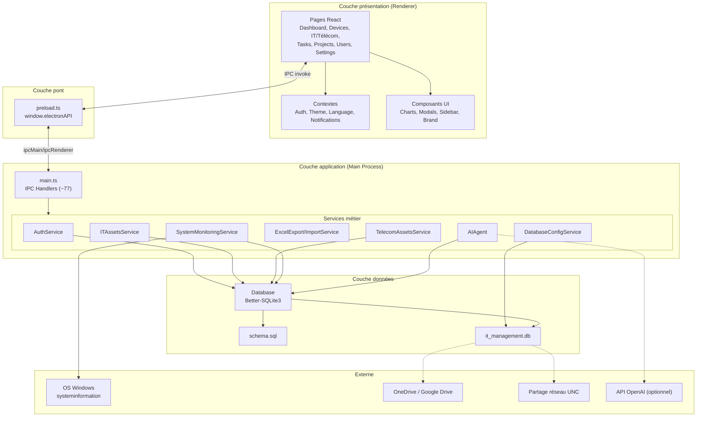

---

## 2. Architecture composants (Electron)

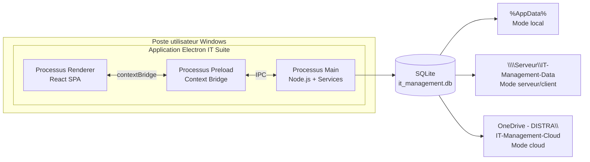

---

## 3. Diagramme de classes — domaine métier (entités)

Modèle dérivé de `electron/database/schema.sql`.

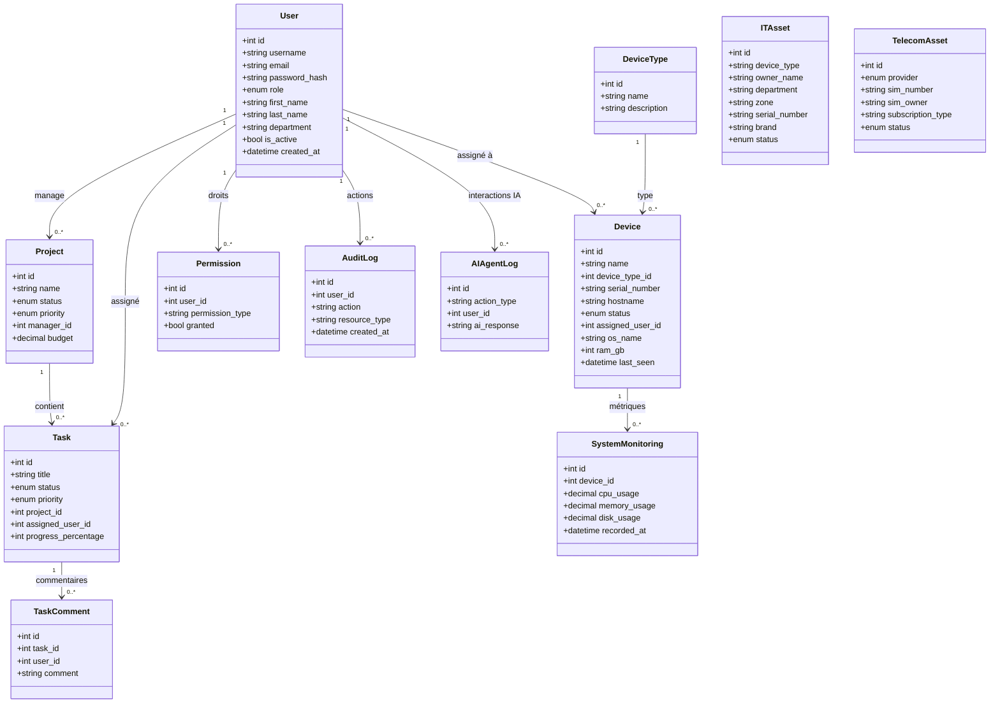

---

## 4. Diagramme de classes — services applicatifs

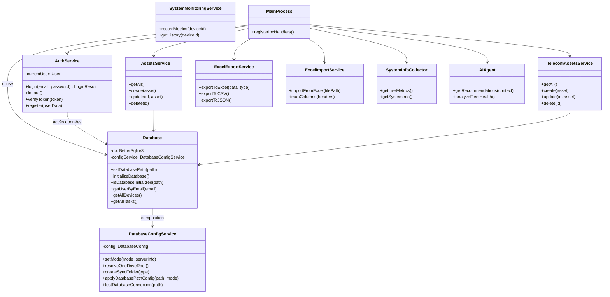

---

## 5. Diagramme de cas d’utilisation

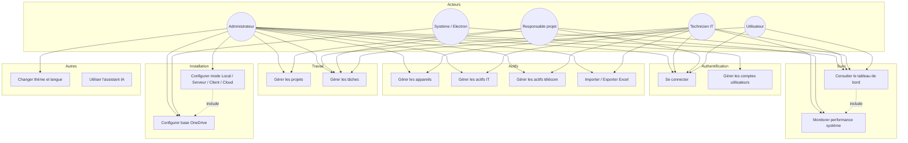

### Tableau des cas d’utilisation

| ID | Cas d’utilisation | Acteur principal | Priorité |
|----|-------------------|------------------|----------|
| UC1 | Se connecter | Tous | Haute |
| UC2 | Gérer les comptes | Admin | Haute |
| UC3 | Configurer le déploiement | Admin | Haute |
| UC4 | Sync OneDrive | Admin | Moyenne |
| UC5 | Gérer appareils | Admin, Technicien | Haute |
| UC6 | Gérer actifs IT | Admin, Technicien | Haute |
| UC7 | Gérer actifs télécom | Admin, Technicien | Haute |
| UC8 | Import/Export | Admin, Technicien | Moyenne |
| UC9 | Gérer projets | Admin, Chef projet | Haute |
| UC10 | Gérer tâches | Tous (selon droits) | Haute |
| UC11 | Tableau de bord | Tous | Haute |
| UC12 | Monitoring | Technicien, Système | Moyenne |
| UC13 | Paramètres UI | Admin | Basse |
| UC14 | Assistant IA | Admin | Basse |

---

## 6. Diagrammes de séquence

### 6.1 Authentification (connexion)

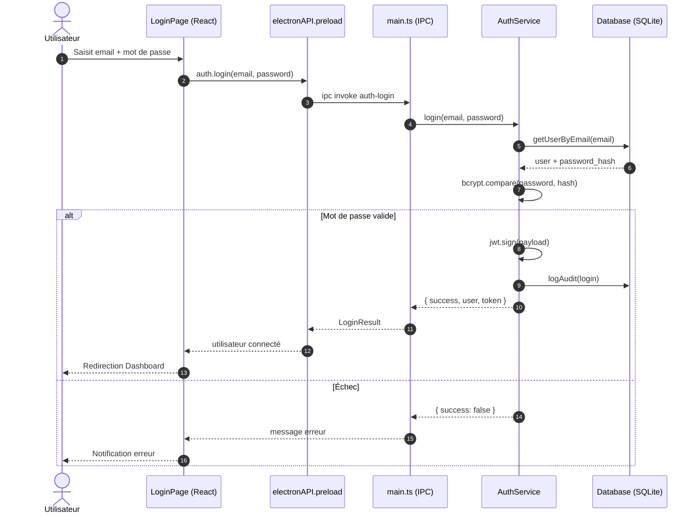

### 6.2 Création d’un actif IT (CRUD via IPC)

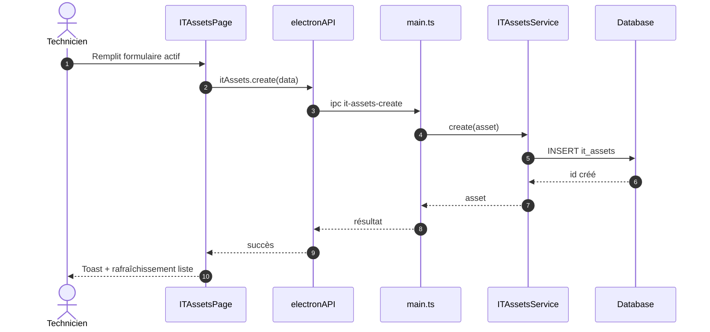

### 6.3 Configuration base OneDrive

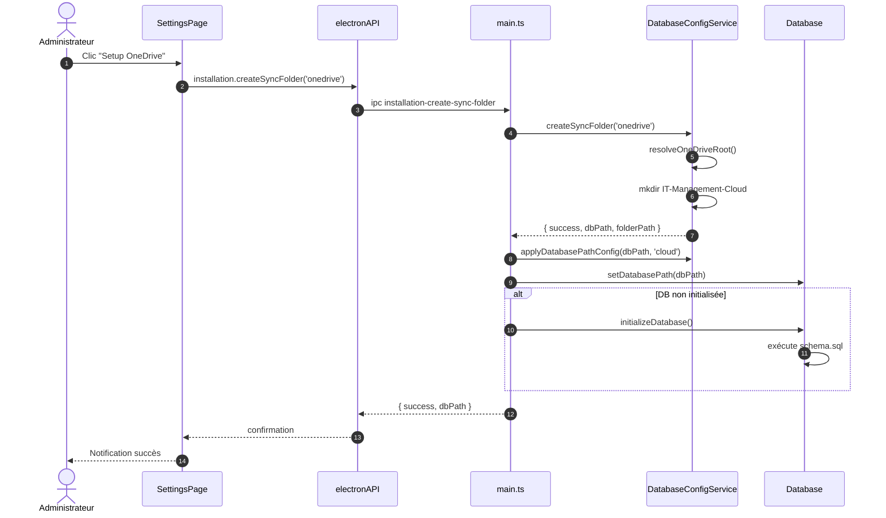

### 6.4 Lecture métriques tableau de bord (temps réel)

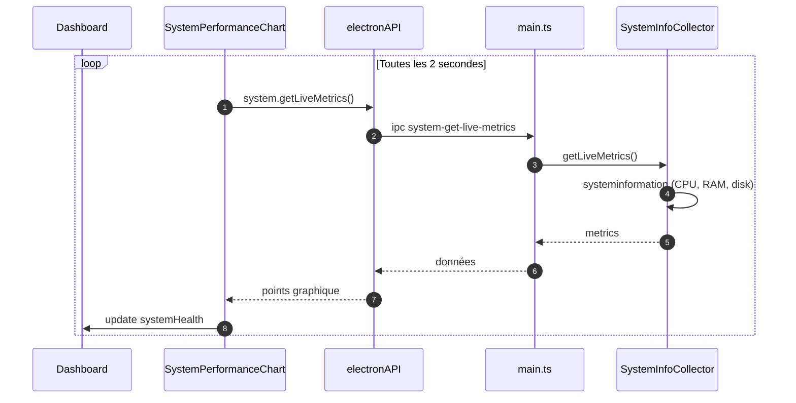

---

## 7. Diagramme de déploiement

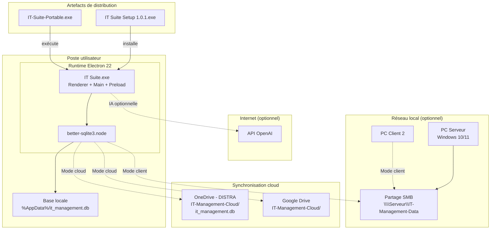

### Modes de déploiement

| Mode | Nœud physique | Fichier de données |
|------|---------------|------------------|
| Local | 1 PC | `%AppData%\...\it_management.db` |
| Serveur | PC serveur + partage SMB | `Documents\IT-Management-Data\` |
| Client | N PCs clients | UNC vers le serveur |
| Cloud | N PCs + OneDrive | `OneDrive*\IT-Management-Cloud\` |

---

## 8. Diagramme de Gantt (planning projet)

Planning type pour un projet académique / professionnel sur **~16 semaines**.

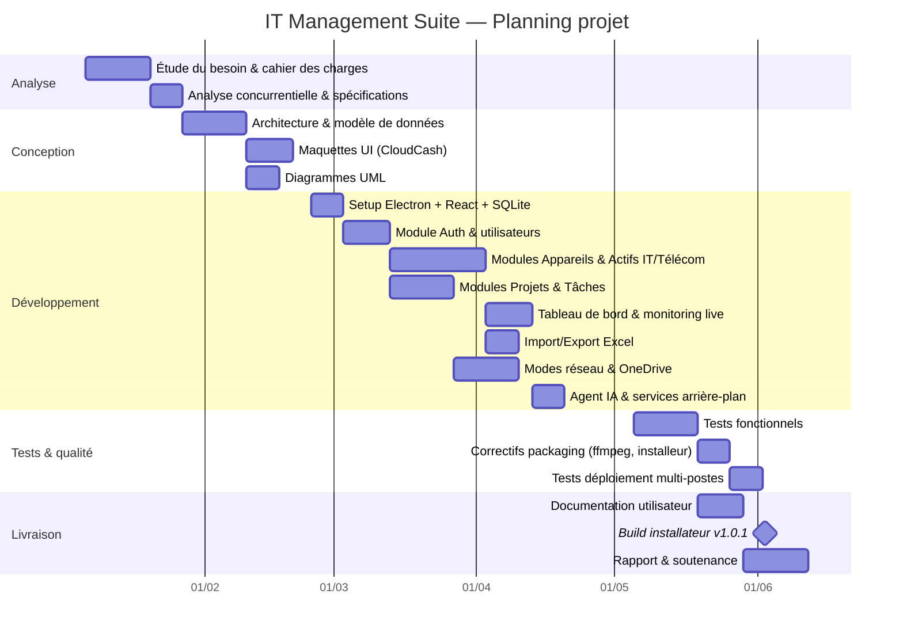

---

## 9. Vue C4 — Contexte système (complément architecture)

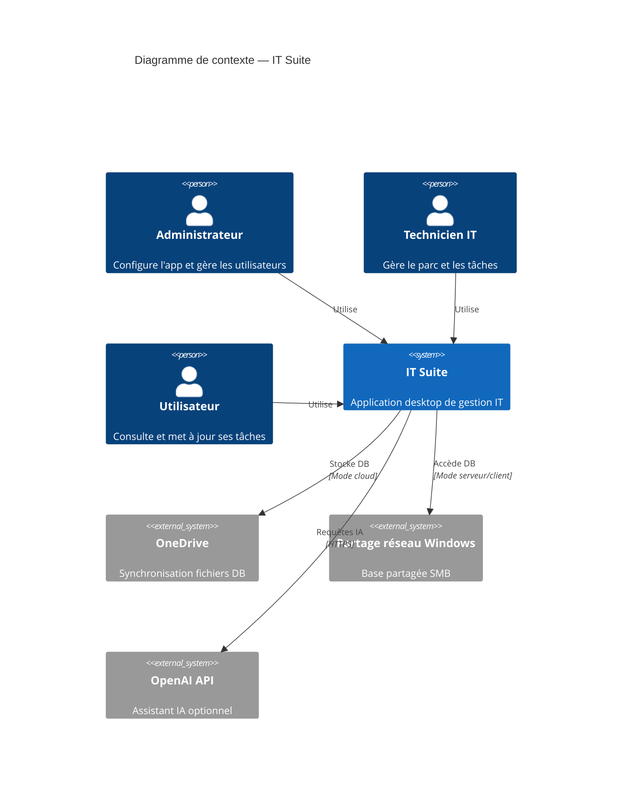

> Si `C4Context` n’est pas supporté par votre outil, utilisez les diagrammes des sections 1 et 7.

---

## 10. Légende et export

| Diagramme | Section | Outil recommandé |
|-----------|---------|------------------|
| Architecture couches | §1 | Mermaid Live |
| Architecture composants | §2 | Mermaid Live |
| Classes métier | §3 | Mermaid / PlantUML |
| Classes services | §4 | Mermaid |
| Cas d’utilisation | §5 | Mermaid / Draw.io |
| Séquences | §6 | Mermaid Live |
| Déploiement | §7 | Mermaid / Draw.io |
| Gantt | §8 | Mermaid / MS Project |
| Contexte C4 | §9 | Mermaid 9.4+ |

**Export PDF :** ouvrir ce fichier dans VS Code avec l’extension « Markdown PDF » ou coller les blocs sur [https://mermaid.live](https://mermaid.live) puis exporter en SVG/PNG.

---

*Document généré pour IT Management Suite v1.0.1 — aligné sur le code source et `schema.sql`.*
